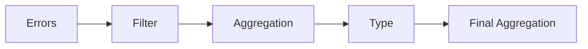

# ProjectLinkage
### Overview
Project based around the DATASUS databases SINASC and SIM.

Focused around finding correlations between both.
### Objectives
- Creating a set of files for each database for future use
- Matching data between both to create a new database
### Workflow

### Folders
- ``examples`` folder has a clear overview of functions used, divided in five notebooks
    - they are organized to allow for easy access in the future
    - there are comments that describe the reason of some of the choices
- ``notebooks`` has some of the actual notebooks used during the process
    - they act more as a reminder of how I used to program, and may be ugly (and easy to get lost), but they help me understand more about how to organize and write clear code, and for that I am thankful.
    - They were written over the course of three weeks